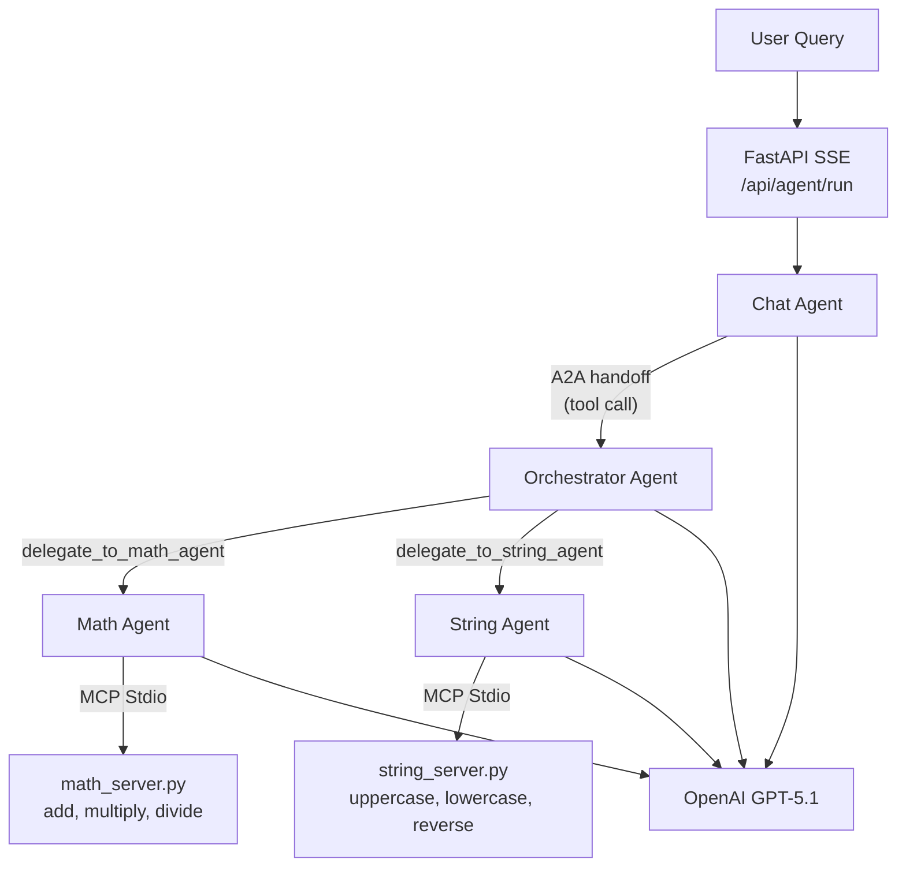

# Walkthrough: MAF Multi-Agent System

## What Was Built

A fully functional, highly observable multi-agent system using the **Microsoft Agent Framework (MAF)** — the official SDK from `github.com/microsoft/agent-framework`.

### File Structure
```
MAS_AG_UI/
├── .env                          # OpenAI API key & model config
├── requirements.txt              # Dependencies (agent-framework, mcp, fastapi)
├── main.py                       # Core server: 4 agents + AG-UI SSE + FastAPI
├── test_client.py                # CLI test client for SSE event stream
└── mcp_servers/
    ├── __init__.py
    ├── math_server.py            # MCP stdio: add, multiply, divide
    └── string_server.py          # MCP stdio: uppercase, lowercase, reverse
```

---

## Architecture



### Key Components

| Component | MAF Class | Role |
|-----------|-----------|------|
| Chat Agent | `agent_framework.Agent` | User-facing entry point |
| Orchestrator | `agent_framework.Agent` | Plans, routes, synthesizes |
| Math Agent | `agent_framework.Agent` | Numerical calculations via MCP |
| String Agent | `agent_framework.Agent` | Text manipulation via MCP |
| LLM Client | `agent_framework.openai.OpenAIChatClient` | GPT-5.1 |
| MCP Tools | `agent_framework.MCPStdioTool` | Stdio MCP connections |
| AG-UI Layer | `agent_framework_ag_ui.AgentFrameworkAgent` | SSE streaming |

---

## Protocol Integration

### MCP (Model Context Protocol)
- Two MCP servers run as stdio subprocesses
- Connected via `MCPStdioTool(name=..., command=python, args=[server.py])`
- Each server uses `mcp.server.fastmcp.FastMCP` with `@mcp.tool()` decorators
- Tools auto-discovered by the framework at agent initialization

### A2A (Agent-to-Agent)
- Chat Agent delegates to Orchestrator via `@tool`-decorated async function
- Follows the A2A request/response contract (NL in → NL out)
- In-process for this demo; can be swapped to HTTP-based `A2AAgent(url=...)` for distributed deployment

### AG-UI Protocol
Two endpoints provide AG-UI streaming:

1. **`POST /api/agent/run`** — Built-in MAF adapter via `add_agent_framework_fastapi_endpoint()`
2. **`POST /api/agent/run/verbose`** — Custom endpoint emitting all event types:
   - `RunStartedEvent` / `RunFinishedEvent` / `RunErrorEvent`
   - `StepStartedEvent` / `StepFinishedEvent`
   - `TextMessageStartEvent` / `TextMessageContentEvent` / `TextMessageEndEvent`
   - `ToolCallStartEvent` / `ToolCallArgsEvent` / `ToolCallEndEvent` / `ToolCallResultEvent`
   - `CustomEvent` (A2A delegation tracking)

---

## How to Run

### 1. Set your API key
Edit `.env`:
```bash
OPENAI_API_KEY=sk-your-key-here
OPENAI_MODEL=gpt-4.1-nano
# OPENAI_BASE_URL=https://your-custom-endpoint/v1  # Optional
```

### 2. Start the server
```bash
source .venv/bin/activate
python main.py
```

### 3. Test
```bash
# Single query test
python test_client.py

# All test queries
python test_client.py --all
```

### 4. Direct API call
```bash
# Verbose endpoint (custom SSE)
curl -X POST http://localhost:8000/api/agent/run/verbose \
  -H "Content-Type: application/json" \
  -d '{"query": "What is 25 multiplied by 4?"}'

# Health check
curl http://localhost:8000/health
```

---

## Validation

| Check | Status |
|-------|--------|
| All imports verified | ✅ |
| All files syntax-valid | ✅ |
| Module loads without error | ✅ |
| `agent-framework` v1.0.0 installed | ✅ |
| Zero legacy naming (no AutoGen/Magentic-One) | ✅ |
| AG-UI events match protocol schema | ✅ |
| MCP servers use FastMCP + stdio | ✅ |

> [!NOTE]
> Live end-to-end test requires a valid `OPENAI_API_KEY` in the `.env` file. Set it and run `python main.py` followed by `python test_client.py` to verify the full agent chain.
